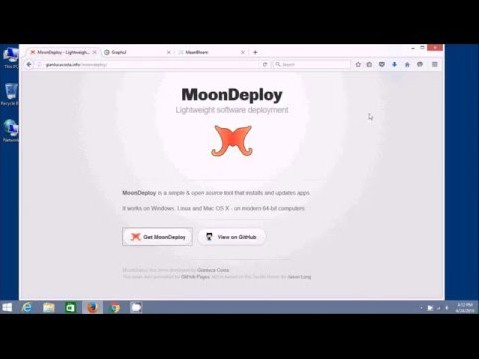

# MoonDeploy

*Lightweight software deployment*


## For software users

If you are a software user, you are probably wondering why you should install MoonDeploy and how you can actually employ it.

Please, have a look at [MoonDeploy for users](https://github.com/giancosta86/moondeploy/wiki/MoonDeploy-for-users) in the wiki.

Finally, you might also want to watch a YouTube video:

[](https://youtu.be/BvpJiD6SZnI)


## For software developers

MoonDeploy is especially interesting for software developers! ^\_\_^!

Please, consult [MoonDeploy for developers](https://github.com/giancosta86/moondeploy/wiki/MoonDeploy-for-developers) in the wiki to learn more about this technology!


### Documentation

* The most important knowledge base is the [wiki](https://github.com/giancosta86/moondeploy/wiki)

* MoonDeploy's Go API has a [dedicated GoDoc page](https://godoc.org/github.com/giancosta86/moondeploy), if you wish to employ its engine for a custom installer


## First applications using MoonDeploy

* [Chronos IDE](http://gianlucacosta.info/Chronos-IDE), the visual development environment of a programming language dedicated to Discrete-Event simulation - created by MoonDeploy's author! :ghost:

* [GraphsJ](http://gianlucacosta.info/GraphsJ), a didactic ScalaFX application and framework for running graph algorithms

* [KnapScal](http://gianlucacosta.info/KnapScal), a ScalaFX didactic application for the Knapsack problem


## Special thanks

The author would like to thank (ordered by surname):

* *Gionata Ercolani*: for his thorough and extensive testing of MoonDeploy 3 on Mac OS X as well as for his valuable suggestions about Mac OS

* *Marco Mengoli*: for his valid feedback and suggestions on Mac OS X


## Further references

* [Official website](http://gianlucacosta.info/moondeploy)

* [MaanBloem](http://gianlucacosta.info/MaanBloem) - App manager for MoonDeploy

* [Facebook page](https://www.facebook.com/MoonDeploy/)


## Technologies

MoonDeploy employs the following technologies:

* [Go](https://golang.org/), which was definitely brilliant for this task! ^\_\_^!

* [GitHub API](https://developer.github.com/) - simple and elegant RESTful access to GitHub's information.

* [Caravel](https://github.com/giancosta86/caravel)

* [LockAPI](https://github.com/giancosta86/LockAPI)

* [gotk3](https://github.com/gotk3/gotk3)

  ```
  Copyright (c) 2013-2014 Conformal Systems LLC.

  Permission to use, copy, modify, and distribute this software for any
  purpose with or without fee is hereby granted, provided that the above
  copyright notice and this permission notice appear in all copies.

  THE SOFTWARE IS PROVIDED "AS IS" AND THE AUTHOR DISCLAIMS ALL WARRANTIES
  WITH REGARD TO THIS SOFTWARE INCLUDING ALL IMPLIED WARRANTIES OF
  MERCHANTABILITY AND FITNESS. IN NO EVENT SHALL THE AUTHOR BE LIABLE FOR
  ANY SPECIAL, DIRECT, INDIRECT, OR CONSEQUENTIAL DAMAGES OR ANY DAMAGES
  WHATSOEVER RESULTING FROM LOSS OF USE, DATA OR PROFITS, WHETHER IN AN
  ACTION OF CONTRACT, NEGLIGENCE OR OTHER TORTIOUS ACTION, ARISING OUT OF
  OR IN CONNECTION WITH THE USE OR PERFORMANCE OF THIS SOFTWARE.
  ```

* [Golang logging library](https://github.com/op/go-logging)

  ```
  Copyright (c) 2013 Örjan Persson. All rights reserved.

  Redistribution and use in source and binary forms, with or without
  modification, are permitted provided that the following conditions are
  met:

     * Redistributions of source code must retain the above copyright
  notice, this list of conditions and the following disclaimer.
     * Redistributions in binary form must reproduce the above
  copyright notice, this list of conditions and the following disclaimer
  in the documentation and/or other materials provided with the
  distribution.
     * Neither the name of Google Inc. nor the names of its
  contributors may be used to endorse or promote products derived from
  this software without specific prior written permission.

  THIS SOFTWARE IS PROVIDED BY THE COPYRIGHT HOLDERS AND CONTRIBUTORS
  "AS IS" AND ANY EXPRESS OR IMPLIED WARRANTIES, INCLUDING, BUT NOT
  LIMITED TO, THE IMPLIED WARRANTIES OF MERCHANTABILITY AND FITNESS FOR
  A PARTICULAR PURPOSE ARE DISCLAIMED. IN NO EVENT SHALL THE COPYRIGHT
  OWNER OR CONTRIBUTORS BE LIABLE FOR ANY DIRECT, INDIRECT, INCIDENTAL,
  SPECIAL, EXEMPLARY, OR CONSEQUENTIAL DAMAGES (INCLUDING, BUT NOT
  LIMITED TO, PROCUREMENT OF SUBSTITUTE GOODS OR SERVICES; LOSS OF USE,
  DATA, OR PROFITS; OR BUSINESS INTERRUPTION) HOWEVER CAUSED AND ON ANY
  THEORY OF LIABILITY, WHETHER IN CONTRACT, STRICT LIABILITY, OR TORT
  (INCLUDING NEGLIGENCE OR OTHERWISE) ARISING IN ANY WAY OUT OF THE USE
  OF THIS SOFTWARE, EVEN IF ADVISED OF THE POSSIBILITY OF SUCH DAMAGE.
  ```


* [Extensions to the "os" package](https://github.com/kardianos/osext)
  ```
  Copyright (c) 2012 The Go Authors. All rights reserved.

  Redistribution and use in source and binary forms, with or without
  modification, are permitted provided that the following conditions are
  met:

     * Redistributions of source code must retain the above copyright
  notice, this list of conditions and the following disclaimer.
     * Redistributions in binary form must reproduce the above
  copyright notice, this list of conditions and the following disclaimer
  in the documentation and/or other materials provided with the
  distribution.
     * Neither the name of Google Inc. nor the names of its
  contributors may be used to endorse or promote products derived from
  this software without specific prior written permission.

  THIS SOFTWARE IS PROVIDED BY THE COPYRIGHT HOLDERS AND CONTRIBUTORS
  "AS IS" AND ANY EXPRESS OR IMPLIED WARRANTIES, INCLUDING, BUT NOT
  LIMITED TO, THE IMPLIED WARRANTIES OF MERCHANTABILITY AND FITNESS FOR
  A PARTICULAR PURPOSE ARE DISCLAIMED. IN NO EVENT SHALL THE COPYRIGHT
  OWNER OR CONTRIBUTORS BE LIABLE FOR ANY DIRECT, INDIRECT, INCIDENTAL,
  SPECIAL, EXEMPLARY, OR CONSEQUENTIAL DAMAGES (INCLUDING, BUT NOT
  LIMITED TO, PROCUREMENT OF SUBSTITUTE GOODS OR SERVICES; LOSS OF USE,
  DATA, OR PROFITS; OR BUSINESS INTERRUPTION) HOWEVER CAUSED AND ON ANY
  THEORY OF LIABILITY, WHETHER IN CONTRACT, STRICT LIABILITY, OR TORT
  (INCLUDING NEGLIGENCE OR OTHERWISE) ARISING IN ANY WAY OUT OF THE USE
  OF THIS SOFTWARE, EVEN IF ADVISED OF THE POSSIBILITY OF SUCH DAMAGE.
  ```

* [InnoSetup](http://www.jrsoftware.org/isinfo.php)

  ```
  Inno Setup License
  ==================

  Except where otherwise noted, all of the documentation and software included
  in the Inno Setup package is copyrighted by Jordan Russell.

  Copyright (C) 1997-2013 Jordan Russell. All rights reserved.
  Portions Copyright (C) 2000-2013 Martijn Laan. All rights reserved.

  This software is provided "as-is," without any express or implied warranty.
  In no event shall the author be held liable for any damages arising from the
  use of this software.

  Permission is granted to anyone to use this software for any purpose,
  including commercial applications, and to alter and redistribute it,
  provided that the following conditions are met:

  1. All redistributions of source code files must retain all copyright
   notices that are currently in place, and this list of conditions without
   modification.

  2. All redistributions in binary form must retain all occurrences of the
     above copyright notice and web site addresses that are currently in
     place (for example, in the About boxes).

  3. The origin of this software must not be misrepresented; you must not
     claim that you wrote the original software. If you use this software to
     distribute a product, an acknowledgment in the product documentation
     would be appreciated but is not required.

  4. Modified versions in source or binary form must be plainly marked as
     such, and must not be misrepresented as being the original software.

  Jordan Russell
  jr-2010 AT jrsoftware.org
  http://www.jrsoftware.org/
  ```
