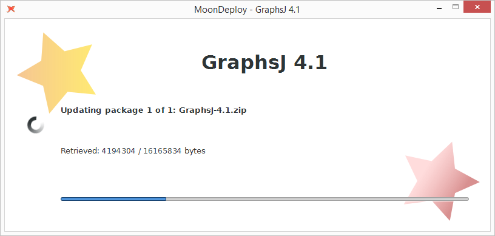
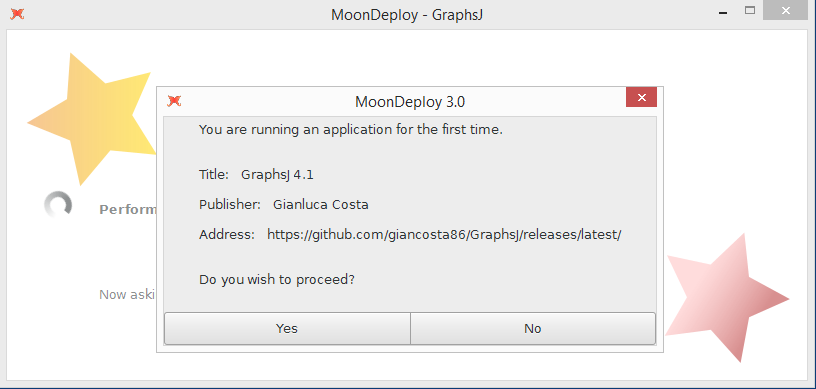
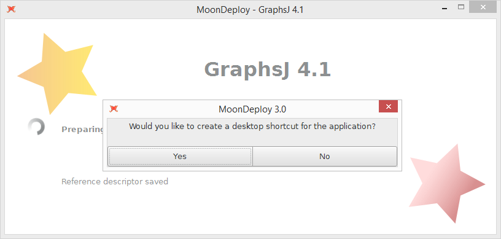

# MoonDeploy

*Lightweight software deployment*


## For software users




### Introduction

MoonDeploy is a cross-platform utility, written in Go, that:

1. Starts any application having an associated **.moondeploy** descriptor

2. Transparently and consistently organizes (by website) such applications in a centralized, per-user directory (called *app gallery*) - by default, such directory is **USER_DIRECTORY/MoonDeploy**

3. Automatically checks for updates and installs them

4. Is especially suitable for open source applications hosted on GitHub

There are already similar solutions (for example Java Web Start, Getdown or Zero Install), but MoonDeploy is designed to make both deployment and installation definitely minimalist and simple, as well as GitHub-aware.


### Requirements

MoonDeploy requires a **64-bit** system. In particular, to correctly start applications from your web browser, it is recommended that you use the **64-bit version of your favorite browser**, which should be free to download from the browser's website.

Actually, on Windows and Linux, MoonDeploy requires the GTK runtime libraries - but they are already provided by the Windows installer and are usually available on modern Linux distributions.


### Installation

MoonDeploy can be easily installed:

* **Windows** - Download *MoonDeploy-windows.exe* from the [download area](https://github.com/giancosta86/moondeploy/releases/latest) and run it: it will install MoonDeploy *for every user in the system*.

* **Linux** - Download *MoonDeploy-linux.zip* from the [download area](https://github.com/giancosta86/moondeploy/releases/latest), extract it and run the *setup.sh* script: it will install MoonDeploy *for the current user*

* **Mac OS X** - it is now supported, but the GUI is command-line only: you should download MoonDeploy's zip file from the [download area](https://github.com/giancosta86/moondeploy/releases/latest), extract it and manually associate MoonDeploy with *.moondeploy* files in your file manager.
If you are an experienced user, you can try to add the GTK+ user interface to your Mac OS version, too: please, consult [the build wiki page](https://github.com/giancosta86/moondeploy/wiki/Building-MoonDeploy).


### Usage

* While consulting a web page in the browser, download a **.moondeploy** file and open it with MoonDeploy - for example, by double-clicking it

* By default, the app gallery, which contains all the installed apps, is **USER_DIRECTORY/MoonDeploy/apps**

* Whenever an application is run, MoonDeploy stores a dedicated log within the logs directory. By default, it is **USER_DIRECTORY/MoonDeploy/logs**

* To uninstall an application, just remove its directory from the app gallery using your file manager


### Screenshots







## For software developers

### Introduction

Software deployment is a very general, platform-specific activity: from simple zip files ready for download up to vast app stores, each solution has both benefits and disadvantages to balance.

Existing solutions such as [Java Web Start](http://www.oracle.com/technetwork/java/javase/javawebstart/index.html), [Getdown](https://github.com/threerings/getdown/) and [Zero Install](http://0install.net/) are brilliant ways of installing applications from the web browser (and not only) to the user's directory - each technology focusing on specific aspects.

*MoonDeploy* is designed to be a lightweight, minimalist deployment tool automating downloads and updates of zip packages containing GUI application components; moreover, it provides a centralized, per-user directory called *App gallery*, where all the apps installed via MoonDeploy reside.


### Principles

* **Minimalism**: no need for creating XML files or for using a dedicated package builder; no need for certificates and signatures: just write a [JSON](http://www.json.org/) file having extension *.moondeploy* (usually, **App.moondeploy**) and deploy it along with the zip files making up your application - for example, the zip files created by Gradle's *application* plugin. Of course, using no certificates implies that HTTPS is strongly suggested to achieve better security.

* **Technology independence**: MoonDeploy is written in **Go**, so it is deployed as a *native executable* on every supported operating system - it reads an application descriptor, applies its update algorithm and runs the application - which can be written in any language!

* **GitHub-friendly**: [GitHub](https://github.com/) is a brilliant platform for software development; applications deployed on GitHub can easily download their latest versions, just by following a very easy naming convention for the BaseURL in their [app descriptor](https://github.com/giancosta86/moondeploy/wiki/App-descriptor:-Version-3).

* **Simplicity**: installed apps reside in the *App gallery* in the user directory, organized by *host* and *base URL path*. Running an application is as easy as making MoonDeploy open a *.moondeploy* file - which can be simplified by the desktop environment. The user can see the files that compose an app by opening its directory in the app gallery. Likewise, uninstalling an app is achieved by deleting the related directory.

* **Extensibility**: MoonDeploy is also *a Go library* which you can use to create a custom installer - not necessarily tied to the centralized app gallery; for example, you might want to create a more intriguing, app-specific loader

* **Granular versioning**: applications are versioned, but versioning can be applied to one or more of their packages as well - in order to download only the required application components

* **HTTP file server**: by running **moondeploy serve {port} {dir}**, MoonDeploy will start an HTTP server, listening on the given port and serving files from the given directory. This enables easy testing of new applications.

  A client can stop it by accessing its **/moondeploy.quit** path.

* **Logging**: MoonDeploy logs almost everything to file, in great detail


### Packaging

* To deploy an application, you don't even need MoonDeploy - just open a text editor to create an [app descriptor](https://github.com/giancosta86/moondeploy/wiki/App-descriptor:-Version-3) in JSON format.

* A few satellite projects deal with automating this process - in particular:

  * [MoonDeploy-Gradle](https://github.com/giancosta86/MoonDeploy-Gradle): a Gradle plugin that makes even simpler the creation of application descriptors

  * [MoonDeploy-Ant](https://github.com/giancosta86/MoonDeploy-Ant): a set of Ant tasks mainly dedicated to developing a custom solution based on MoonDeploy and Ant


* To install the Go library for *very* customized installers, run:
 ```
 go get github.com/giancosta86/moondeploy
 go install github.com/giancosta86/moondeploy
 ```

 then refer to the GoDoc page cited below.


### Documentation


* The most important documents are in the [user-friendly wiki](https://github.com/giancosta86/moondeploy/wiki)

* MoonDeploy's Go API has a [dedicated GoDoc page](https://godoc.org/github.com/giancosta86/moondeploy), if you wish to employ its engine for a custom installer


## Special thanks

The author would like to thank (ordered by surname):

* *Gionata Ercolani*: for his thorough and extensive testing of MoonDeploy 3 on Mac OS X as well as for his valuable suggestions about Mac OS

* *Marco Mengoli*: for his valid feedback and suggestions on Mac OS X


## See also

* [Chronos IDE](https://github.com/giancosta86/Chronos-IDE), the development environment for my very first programming language!  :ghost:  It's also the very first application using MoonDeploy.

* [GraphsJ](https://github.com/giancosta86/GraphsJ), a didactic ScalaFX application and framework for running graph algorithms

* [KnapScal](https://github.com/giancosta86/KnapScal), a ScalaFX didactic application for the Knapsack problem

* [Facebook page](https://www.facebook.com/MoonDeploy/)


## Technologies

MoonDeploy employs the following technologies:

* [Go](https://golang.org/), which was definitely brilliant for this task! ^\_\_^!

* [GitHub API](https://developer.github.com/) - simple and elegant RESTful access to GitHub's information.

* [Caravel](https://github.com/giancosta86/caravel)

* [LockAPI](https://github.com/giancosta86/LockAPI)

* [gotk3](https://github.com/gotk3/gotk3)

  ```
  Copyright (c) 2013-2014 Conformal Systems LLC.

  Permission to use, copy, modify, and distribute this software for any
  purpose with or without fee is hereby granted, provided that the above
  copyright notice and this permission notice appear in all copies.

  THE SOFTWARE IS PROVIDED "AS IS" AND THE AUTHOR DISCLAIMS ALL WARRANTIES
  WITH REGARD TO THIS SOFTWARE INCLUDING ALL IMPLIED WARRANTIES OF
  MERCHANTABILITY AND FITNESS. IN NO EVENT SHALL THE AUTHOR BE LIABLE FOR
  ANY SPECIAL, DIRECT, INDIRECT, OR CONSEQUENTIAL DAMAGES OR ANY DAMAGES
  WHATSOEVER RESULTING FROM LOSS OF USE, DATA OR PROFITS, WHETHER IN AN
  ACTION OF CONTRACT, NEGLIGENCE OR OTHER TORTIOUS ACTION, ARISING OUT OF
  OR IN CONNECTION WITH THE USE OR PERFORMANCE OF THIS SOFTWARE.
  ```

* [Golang logging library](https://github.com/op/go-logging)

  ```
  Copyright (c) 2013 Örjan Persson. All rights reserved.

  Redistribution and use in source and binary forms, with or without
  modification, are permitted provided that the following conditions are
  met:

     * Redistributions of source code must retain the above copyright
  notice, this list of conditions and the following disclaimer.
     * Redistributions in binary form must reproduce the above
  copyright notice, this list of conditions and the following disclaimer
  in the documentation and/or other materials provided with the
  distribution.
     * Neither the name of Google Inc. nor the names of its
  contributors may be used to endorse or promote products derived from
  this software without specific prior written permission.

  THIS SOFTWARE IS PROVIDED BY THE COPYRIGHT HOLDERS AND CONTRIBUTORS
  "AS IS" AND ANY EXPRESS OR IMPLIED WARRANTIES, INCLUDING, BUT NOT
  LIMITED TO, THE IMPLIED WARRANTIES OF MERCHANTABILITY AND FITNESS FOR
  A PARTICULAR PURPOSE ARE DISCLAIMED. IN NO EVENT SHALL THE COPYRIGHT
  OWNER OR CONTRIBUTORS BE LIABLE FOR ANY DIRECT, INDIRECT, INCIDENTAL,
  SPECIAL, EXEMPLARY, OR CONSEQUENTIAL DAMAGES (INCLUDING, BUT NOT
  LIMITED TO, PROCUREMENT OF SUBSTITUTE GOODS OR SERVICES; LOSS OF USE,
  DATA, OR PROFITS; OR BUSINESS INTERRUPTION) HOWEVER CAUSED AND ON ANY
  THEORY OF LIABILITY, WHETHER IN CONTRACT, STRICT LIABILITY, OR TORT
  (INCLUDING NEGLIGENCE OR OTHERWISE) ARISING IN ANY WAY OUT OF THE USE
  OF THIS SOFTWARE, EVEN IF ADVISED OF THE POSSIBILITY OF SUCH DAMAGE.
  ```


* [Extensions to the "os" package](https://github.com/kardianos/osext)
  ```
  Copyright (c) 2012 The Go Authors. All rights reserved.

  Redistribution and use in source and binary forms, with or without
  modification, are permitted provided that the following conditions are
  met:

     * Redistributions of source code must retain the above copyright
  notice, this list of conditions and the following disclaimer.
     * Redistributions in binary form must reproduce the above
  copyright notice, this list of conditions and the following disclaimer
  in the documentation and/or other materials provided with the
  distribution.
     * Neither the name of Google Inc. nor the names of its
  contributors may be used to endorse or promote products derived from
  this software without specific prior written permission.

  THIS SOFTWARE IS PROVIDED BY THE COPYRIGHT HOLDERS AND CONTRIBUTORS
  "AS IS" AND ANY EXPRESS OR IMPLIED WARRANTIES, INCLUDING, BUT NOT
  LIMITED TO, THE IMPLIED WARRANTIES OF MERCHANTABILITY AND FITNESS FOR
  A PARTICULAR PURPOSE ARE DISCLAIMED. IN NO EVENT SHALL THE COPYRIGHT
  OWNER OR CONTRIBUTORS BE LIABLE FOR ANY DIRECT, INDIRECT, INCIDENTAL,
  SPECIAL, EXEMPLARY, OR CONSEQUENTIAL DAMAGES (INCLUDING, BUT NOT
  LIMITED TO, PROCUREMENT OF SUBSTITUTE GOODS OR SERVICES; LOSS OF USE,
  DATA, OR PROFITS; OR BUSINESS INTERRUPTION) HOWEVER CAUSED AND ON ANY
  THEORY OF LIABILITY, WHETHER IN CONTRACT, STRICT LIABILITY, OR TORT
  (INCLUDING NEGLIGENCE OR OTHERWISE) ARISING IN ANY WAY OUT OF THE USE
  OF THIS SOFTWARE, EVEN IF ADVISED OF THE POSSIBILITY OF SUCH DAMAGE.
  ```

* [InnoSetup](http://www.jrsoftware.org/isinfo.php)

  ```
  Inno Setup License
  ==================

  Except where otherwise noted, all of the documentation and software included
  in the Inno Setup package is copyrighted by Jordan Russell.

  Copyright (C) 1997-2013 Jordan Russell. All rights reserved.
  Portions Copyright (C) 2000-2013 Martijn Laan. All rights reserved.

  This software is provided "as-is," without any express or implied warranty.
  In no event shall the author be held liable for any damages arising from the
  use of this software.

  Permission is granted to anyone to use this software for any purpose,
  including commercial applications, and to alter and redistribute it,
  provided that the following conditions are met:

  1. All redistributions of source code files must retain all copyright
   notices that are currently in place, and this list of conditions without
   modification.

  2. All redistributions in binary form must retain all occurrences of the
     above copyright notice and web site addresses that are currently in
     place (for example, in the About boxes).

  3. The origin of this software must not be misrepresented; you must not
     claim that you wrote the original software. If you use this software to
     distribute a product, an acknowledgment in the product documentation
     would be appreciated but is not required.

  4. Modified versions in source or binary form must be plainly marked as
     such, and must not be misrepresented as being the original software.

  Jordan Russell
  jr-2010 AT jrsoftware.org
  http://www.jrsoftware.org/
  ```
